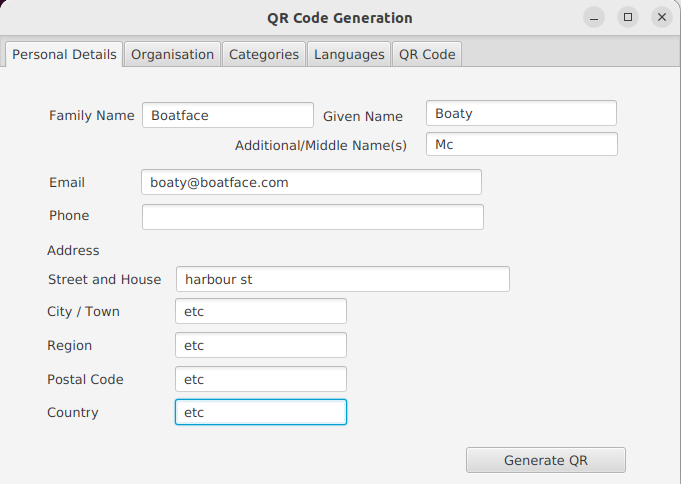
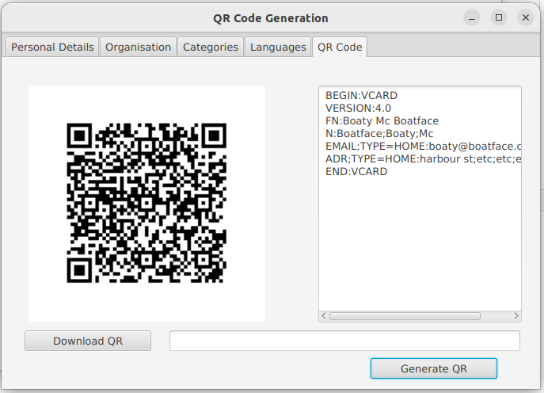

# demo-FX

This is a JavaFX demo application which accepts data via the UI, validates (some of) it, and generates a QR code using the (VCard formatted) data on request.

It also implements ..
1) JPA integration ( the 'categories' tab loads data from an in-memory H2 database)
2) XLSX integration (the languages tab loads data from an xlsx spreadsheet in the resources folder)

As such it's a simple demo to show desktop JavaFX-based UI design, integration with databases, spreadsheets, and the file system.

### Technical 

Written in Java 17 and JavaFX 17.0.7

Development platform:
```agsl
JavaFX Scene Builder 19.0.0
JavaFX Version: 19
Java Version: 17, OpenJDK Runtime Environment
Operating System
Linux, amd64, 5.15.0-71-generic
```

The 'Scene Builder' application was used to format the GUI layout.

Note that JavaFX is not part of the standard Java VM anymore, so for development it has to be installed/referenced seperately.

### Packaging

See https://openjfx.io/openjfx-docs/#maven

 .... for a description about how to create a cross platform fat jar 

### Command line execution

1) produce the fat jar by running
```
mvn clean compile package
```
2) run it with Java 17 - create a runnable shell script with the following contents (or use the 'runFx.sh' script in the project):
```
#!/usr/bin/env bash

$JAVA_HOME/bin/java -jar shade/DemoFX.jar
```

### TODO

1) ... write a lot more tests, particularly after finding out how test the GUI elements rather than just the business logic ....
2) Fix jacoco stats generation during build

### Example images 



and ...

